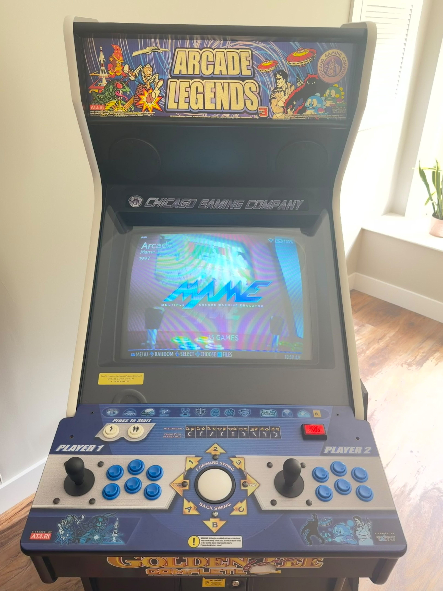

# Arcade Legends 3 → Batocera

This project documents the conversion of a **Chicago Gaming Company Arcade Legends 3** cabinet to **Batocera**, while preserving as much of the original arcade hardware as practical.

The original game computer was replaced by a laptop running Batocera, but the cabinet itself remains largely original. The conversion keeps the CRT, control panel, joysticks, buttons, trackball, speakers, wiring, and original controller/interface electronics.

The goal was simple:

> Modernize the game platform without unnecessarily replacing the arcade machine around it.

## What was preserved

The project keeps the original cabinet and artwork, original CRT monitor, original two-player control panel, original joysticks and buttons, original trackball, original speakers and audio path, original cabinet wiring, and original controller/interface electronics.

The original motherboard is no longer used as the game computer. Batocera now runs on a laptop connected to the cabinet.

For the full physical conversion with photos, see:

**[Hardware Conversion](docs/hardware.md)**

## How the conversion works

The original Arcade Legends controls do not appear to Linux as standard USB gamepads.

The cabinet controller is connected to the Batocera laptop by USB. Linux detects the controller's FTDI serial interface as:

    FT232R USB UART
    /dev/ttyUSB0

The verified serial configuration is:

    115200 8N1

A custom Python bridge reads the Arcade Legends controller data and converts it into standard Linux UInput devices.

    Original controls and trackball
                ↓
    Original Arcade Legends controller/interface
                ↓
    USB connection
                ↓
    FTDI serial interface
    /dev/ttyUSB0
                ↓
    al3_bridge.py
                ↓
    AL3 Player 1
    AL3 Player 2
    AL3 Trackball
    AL3 Hotkeys
                ↓
    Linux input
                ↓
    SDL / Batocera / MAME

The main bridge script is:

    scripts/al3_bridge.py

On the cabinet it is installed as:

    /userdata/system/al3_bridge.py

## Controls

The original two-player controls remain in use.

The bridge creates separate virtual controllers for Player 1 and Player 2 and also creates dedicated trackball and hotkey devices.

The existing player buttons provide both Start and Coin without adding any new physical buttons:

    Tap player button
    → START

    Hold for approximately one second
    → SELECT / COIN

The verified SDL mappings are:

    Button 6 → SELECT / COIN
    Button 7 → START

The original trackball is translated to relative Linux mouse movement using:

    REL_X
    REL_Y

This allows the original trackball to work with Batocera and MAME and also provides the relative input needed by certain dial/spinner-style games.

More detail is available here:

**[Controls](docs/controls.md)**

## Automatic startup

The controller bridge starts automatically using Batocera's service mechanism.

The repository includes:

    services/AL3_Bridge

On the cabinet it is installed as:

    /userdata/system/services/AL3_Bridge

The service waits for `/dev/ttyUSB0`, starts the bridge, logs activity, and restarts the bridge if it exits.

The project also includes:

    services/Force_Headphones

This forces the required analog audio output after boot. The sink name in that service is specific to the Batocera laptop used in this build and may need to be changed on another system.

## Video and audio

The Batocera laptop connects to the original cabinet through three main paths:

    USB
    → original controller/interface electronics

    VGA
    → original CRT video path

    Analog audio
    → original cabinet audio path

The original CRT remains in use, as do the original cabinet speakers.

This was an important part of the conversion because it preserves the original look and feel of the machine instead of turning it into a generic LCD-based arcade cabinet.

## Game-specific examples

The project avoids changing global emulator settings to solve problems that affect only one game.

Instead, game-specific fixes are applied only where needed.

### Tempest

Tempest is an example of a game that required relative mouse input to support its dial/spinner-style controls.

The working configuration is:

    mame["tempest.zip"].core=mame
    mame["tempest.zip"].emulator=libretro
    mame["tempest.zip"].retroarchcore.mame_mouse_enable=enabled

### Pac-Man and Frogger

Pac-Man and Frogger are examples of games that required custom CRT viewport settings because the default image was too large for the visible area of this cabinet's CRT.

The working viewport used on this cabinet is:

    335 x 447

Those values are specific to this machine and should be treated as examples rather than universal settings.

The important rule is:

> If the problem exists in one game, fix one game. If it exists everywhere, fix the global configuration.

The verified examples are documented here:

**[Game-Specific Fixes](docs/game-fixes.md)**

The repository also includes:

    config/game-overrides.conf

with the current verified per-game overrides.

## Installation

For the condensed setup procedure, see:

**[INSTALL.md](INSTALL.md)**

The installation guide covers:

1. verifying the controller connection
2. installing the AL3 bridge
3. installing the Batocera service
4. updating the EmulationStation Start/Select mappings
5. verifying controller input with Linux and SDL tools
6. configuring the audio output
7. applying game-specific overrides where needed

## Important Batocera paths

The main persistent files used by this project are:

    /userdata/system/al3_bridge.py
    /userdata/system/al3_bridge.log
    /userdata/system/services/AL3_Bridge
    /userdata/system/services/Force_Headphones
    /userdata/system/configs/emulationstation/es_input.cfg
    /userdata/system/batocera.conf

The custom configuration is kept under `/userdata` so it survives normal Batocera reboots and updates.

## Troubleshooting philosophy

Troubleshoot from the lowest layer upward:

    Physical control
          ↓
    Original cabinet wiring
          ↓
    Controller/interface board
          ↓
    USB / FTDI serial interface
          ↓
    /dev/ttyUSB0
          ↓
    AL3 bridge
          ↓
    Linux input
          ↓
    EmulationStation / Batocera
          ↓
    MAME
          ↓
    Individual game

Useful commands include:

    ls -l /dev/ttyUSB*
    dmesg | grep -i -E 'ftdi|ttyUSB'
    ps aux | grep '[a]l3_bridge.py'
    batocera-services list | grep -i AL3
    evtest
    export DISPLAY=:0.0
    sdl2-jstest --list
    tail -f /userdata/system/al3_bridge.log

For the full diagnostic process, see:

**[Troubleshooting](docs/troubleshooting.md)**

## Documentation

- **[Installation](INSTALL.md)**
- **[Hardware Conversion](docs/hardware.md)**
- **[Batocera Configuration](docs/batocera-configuration.md)**
- **[Controls](docs/controls.md)**
- **[Game-Specific Fixes](docs/game-fixes.md)**
- **[Troubleshooting](docs/troubleshooting.md)**

## Repository structure

    arcade-legends-3-batocera/
    ├── README.md
    ├── INSTALL.md
    ├── LICENSE
    ├── config/
    │   └── game-overrides.conf
    ├── docs/
    │   ├── hardware.md
    │   ├── batocera-configuration.md
    │   ├── controls.md
    │   ├── game-fixes.md
    │   └── troubleshooting.md
    ├── images/
    ├── scripts/
    │   ├── al3_bridge.py
    │   └── update_es_input.py
    └── services/
        ├── AL3_Bridge
        └── Force_Headphones

## Status

The cabinet is currently operational with:

- original two-player controls
- original trackball
- Start/Coin long-press behavior
- original CRT
- original cabinet audio
- automatic controller bridge startup
- persistent Batocera configuration
- game-specific control overrides
- game-specific CRT viewport overrides

## License

Released under the **[MIT License](LICENSE)**.
