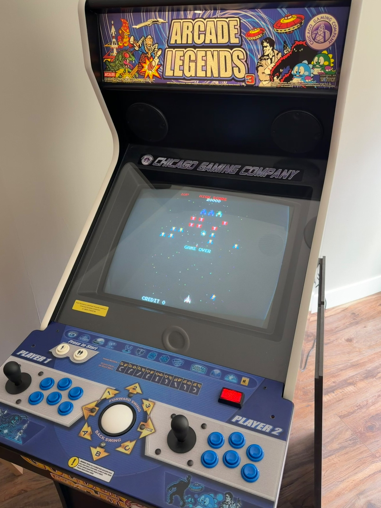
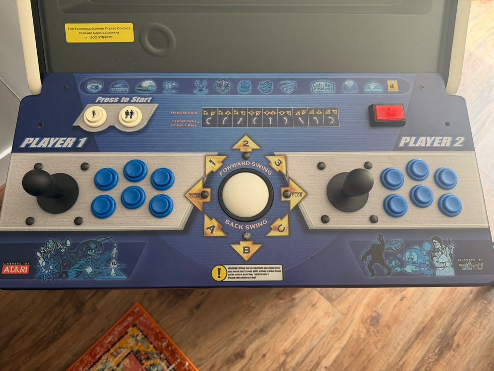

# Hardware Conversion

This section documents the physical conversion of the original **Chicago Gaming Company Arcade Legends 3** cabinet into a Batocera-based arcade system.

The objective was not to gut the cabinet and rebuild it around generic USB arcade encoders.

Instead, the project preserves as much of the original cabinet hardware as practical:

* original cabinet
* original control panel
* original joysticks and buttons
* original trackball
* original interface/control electronics
* original CRT display
* original cabinet audio path

The original game computer was replaced by a laptop running Batocera.

The result preserves the original arcade appearance and feel while replacing the game platform with a modern emulation system.

---

# Finished Cabinet

The cabinet retains its original Arcade Legends appearance, marquee, artwork, control panel, CRT, and speakers.


A game running on the completed cabinet:



One of the main goals of this project was to modernize the game system without making the cabinet look like a PC conversion.

---

# Original Control Panel

The original Arcade Legends control panel was retained.



The panel includes:

* Player 1 joystick
* Player 1 action buttons
* Player 2 joystick
* Player 2 action buttons
* original player/start buttons
* central trackball
* original cabinet controls

No extra Coin or Start buttons were drilled into the panel.

Instead, the custom controller bridge gives the existing player buttons two functions:

```text
Tap
→ START

Hold for approximately one second
→ COIN / SELECT
```

This keeps the original control panel intact while still providing the functions required by Batocera and MAME.

The software implementation is documented in:

[`controls.md`](controls.md)

---

# Original Cabinet Electronics

The original cabinet electronics include the original game motherboard and a separate Arcade Legends interface/control board.


The original motherboard can be seen separately here:


The original motherboard is no longer responsible for running the games.

However, the original interface/control electronics remain useful because they already connect to the cabinet controls and wiring.

This allows the original:

```text
joysticks
buttons
player controls
trackball
cabinet wiring
```

to remain in use without being completely rewired.

---

# Hardware Strategy

The basic conversion is:

```text
Original joysticks / buttons / trackball
                │
                ▼
Original Arcade Legends interface board
                │
                ▼
USB connection
                │
                ▼
FTDI serial interface seen by Linux
                │
                ▼
/dev/ttyUSB0
                │
                ▼
Batocera laptop
                │
                ▼
AL3 software bridge
                │
                ▼
Linux virtual controllers
```

The original motherboard is removed from the active game-processing path, while the useful original cabinet hardware stays in service.

---

# Original Interface Board

The retained Arcade Legends interface board remains connected to the cabinet wiring.


This board is important because it already interfaces with the original cabinet controls.

Instead of replacing that hardware, the project reads its output and translates it in software.

When connected to the Batocera laptop, Linux identifies the controller interface as:

```text
FT232R USB UART
```

and exposes it as:

```text
/dev/ttyUSB0
```

The working serial configuration is:

```text
115200 baud
8 data bits
no parity
1 stop bit
no hardware flow control
```

or, more compactly:

```text
115200 8N1
```

The custom AL3 input bridge reads the serial data and converts it into standard Linux input events.

---

# Batocera Computer

A laptop now serves as the Batocera computer.

The laptop connects to the cabinet through three main paths:

```text
USB
→ original controller/interface electronics

Analog audio
→ original cabinet audio path

VGA
→ original CRT video path
```

This allows the original display, sound system, and controls to remain in use.

---

# Controller and Audio Connections

The USB controller connection and analog audio connection can be seen here:


The USB connection carries the original cabinet controller data.

On the Batocera side, that connection appears as:

```text
/dev/ttyUSB0
```

The custom Python bridge then creates:

```text
AL3 Player 1
AL3 Player 2
AL3 Trackball
AL3 Hotkeys
```

as standard Linux input devices.

The analog audio connection feeds the cabinet's existing audio system.

A Batocera startup service is used to force the correct analog audio output after boot.

That service is included in the repository as:

```text
services/Force_Headphones
```

---

# Video Connection

Video from the Batocera laptop is connected through VGA.


The physical video path is approximately:

```text
Batocera laptop
       │
       ▼
VGA output
       │
       ▼
Original cabinet video path
       │
       ▼
CRT monitor
```

Preserving the original CRT was an important part of the project.

Classic arcade games look and feel much closer to their original presentation on the cabinet's CRT than they would on a modern flat-panel display.

---

# Original CRT

The original CRT monitor was retained.

Rear view:


The CRT assembly, mounting structure, wiring, and associated electronics remain in the cabinet.

This avoided one of the largest physical modifications common in arcade conversions: removing the CRT and installing an LCD.

Keeping the original CRT also means display configuration must respect the physical visible area of the monitor.

This is why some games may require individual viewport adjustments.

Examples include:

```text
Pac-Man
Frogger
```

Those settings are documented in:

[`game-fixes.md`](game-fixes.md)

---

# What Was Replaced and What Was Retained

The conversion can be summarized as:

| Component                        | Status                              |
| -------------------------------- | ----------------------------------- |
| Cabinet                          | Retained                            |
| Marquee                          | Retained                            |
| Cabinet artwork                  | Retained                            |
| Speakers                         | Retained                            |
| CRT                              | Retained                            |
| Player 1 controls                | Retained                            |
| Player 2 controls                | Retained                            |
| Trackball                        | Retained                            |
| Original control wiring          | Retained                            |
| Original interface/control board | Retained                            |
| Original game motherboard        | No longer used as the game computer |
| Game operating system            | Replaced with Batocera              |
| Game computer                    | Batocera laptop                     |

This is fundamentally different from a full gut-and-rewire conversion.

---

# Why Retain the Original Interface Electronics?

A conventional arcade conversion could have used generic USB arcade encoder boards.

That would have required rewiring:

```text
Player 1 joystick
Player 1 buttons
Player 2 joystick
Player 2 buttons
Start controls
Trackball
other cabinet functions
```

Instead, this project keeps the original controller electronics and translates their proprietary output in software.

Conceptually:

```text
Original cabinet hardware
          ↓
Original interface board
          ↓
Serial protocol
          ↓
Software translation
          ↓
Standard Linux input
```

This preserves far more of the original cabinet and significantly reduces unnecessary rewiring.

---

# AL3 Input Bridge

The original interface does not present itself to Linux as a normal USB gamepad.

It sends a repeating serial data stream.

The custom bridge:

```text
scripts/al3_bridge.py
```

reads that data and creates four Linux UInput devices:

```text
AL3 Player 1
AL3 Player 2
AL3 Trackball
AL3 Hotkeys
```

The software stack above the bridge then becomes:

```text
Linux input
    ↓
SDL
    ↓
Batocera
    ↓
MAME
```

From Batocera's point of view, the original proprietary cabinet controls now behave like normal Linux input devices.

---

# Automatic Bridge Startup

The controller bridge is started automatically by the Batocera service:

```text
services/AL3_Bridge
```

On the cabinet, it is installed as:

```text
/userdata/system/services/AL3_Bridge
```

The service:

1. waits for `/dev/ttyUSB0`
2. starts `al3_bridge.py`
3. logs its activity
4. restarts the bridge if it exits

This avoids startup timing problems where the controller interface is not yet available when Batocera boots.

---

# Trackball Preservation

The original trackball remains part of the control panel.

The Arcade Legends controller reports trackball movement through the original interface.

The bridge converts that movement into Linux relative input events:

```text
REL_X
REL_Y
```

This makes the original arcade trackball appear to MAME as a mouse-style relative input device.

It also provides the relative input path used for games that require spinner or dial behavior.

Tempest is one example.

---

# Start and Coin Without Adding Buttons

The original player buttons were preserved.

Instead of adding separate Coin buttons, the software gives each player button two behaviors.

```text
Short press
→ START

Long press
→ SELECT / COIN
```

This was implemented in software rather than modifying the cabinet hardware.

It is a good example of the overall project philosophy:

> Preserve the physical cabinet and solve compatibility problems in software when practical.

---

# Audio

The original cabinet speakers and audio path remain in use.

The Batocera laptop provides analog audio to the cabinet.

Because Batocera did not always select the intended analog output automatically, a startup service was created:

```text
services/Force_Headphones
```

It selects:

```text
analog-output-headphones
```

on the configured audio sink.

This is a software-side correction for the Batocera computer rather than a modification to the original cabinet audio system.

---

# Serviceability

One of the advantages of preserving the existing cabinet wiring is that the system remains modular.

The controller path is:

```text
Control panel
     ↓
Original cabinet wiring
     ↓
Original interface board
     ↓
USB
     ↓
Batocera computer
```

The audio and video paths are separate.

That means the Batocera computer can potentially be replaced later without rebuilding the control panel.

---

# Hardware Troubleshooting

When a control does not work, troubleshoot from the physical layer upward:

```text
Physical control
        ↓
Original wiring
        ↓
Original interface board
        ↓
USB / FTDI serial connection
        ↓
/dev/ttyUSB0
        ↓
al3_bridge.py
        ↓
Linux input
        ↓
Batocera
        ↓
MAME
```

For example, if:

```text
/dev/ttyUSB0
```

does not exist, investigate the controller/USB connection before changing emulator settings.

If:

```text
evtest
```

shows the correct control event but a game does not respond, the physical hardware and bridge are probably working correctly and troubleshooting should move higher in the stack.

See:

[`troubleshooting.md`](troubleshooting.md)

for the complete troubleshooting workflow.

---

# Final Hardware Architecture

The completed cabinet can be summarized as:

```text
                    ORIGINAL CABINET

      ┌─────────────────────────────────────┐
      │                                     │
      │  Joysticks / Buttons / Trackball    │
      │                │                    │
      │                ▼                    │
      │     Original Interface Board        │
      │                │                    │
      │                │ USB / FTDI         │
      │                ▼                    │
      │          Batocera Laptop            │
      │           │           │             │
      │           │           │             │
      │       VGA │       Audio             │
      │           │           │             │
      │           ▼           ▼             │
      │       Original      Original         │
      │          CRT        Speakers         │
      │                                     │
      └─────────────────────────────────────┘
```

The major physical components of the original Arcade Legends cabinet remain in service.

The principal change is the computer and software platform.

---

# Result

The finished conversion preserves:

* original cabinet
* original artwork
* original control panel
* original joysticks and buttons
* original trackball
* original interface electronics
* original CRT
* original speakers
* original cabinet wiring

while adding:

* Batocera
* modern MAME emulation
* software-defined Start/Coin behavior
* automatic controller translation
* persistent startup services
* per-game input and display overrides

That combination was the main goal of the project:

> Modernize the game platform without unnecessarily replacing the arcade machine around it.
